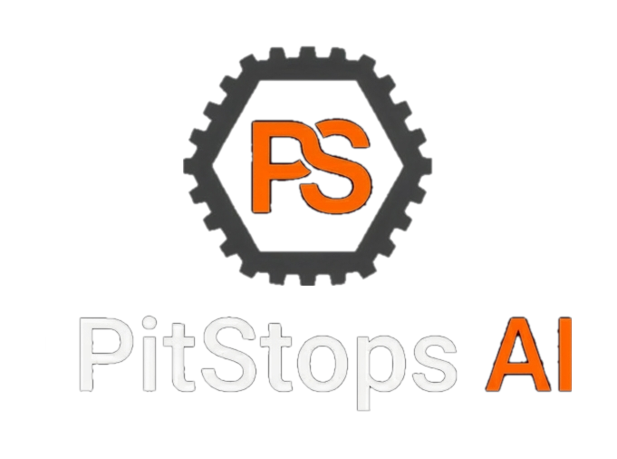
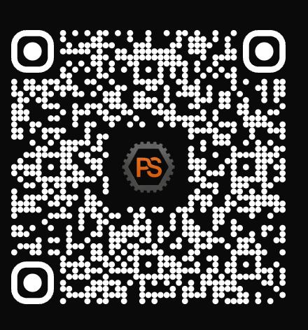

<p align="center">
  
</p>

Sistema inteligente de prediagnóstico conversacional para talleres mecánicos.

El cliente le escribe al bot — "el auto no arranca" — y del otro lado responde
la IA en vez del mecánico: hace las preguntas justas y necesarias según un
árbol dinámico adaptado al síntoma, y entrega al taller una **Pre-OT**
(preorden de trabajo) ya estructurada: vehículo, síntoma, urgencia, posibles
causas, tiempo estimado y herramientas sugeridas — antes de que el auto llegue
al taller.

> El canal pensado en el anteproyecto es el WhatsApp Business que el taller ya
> usa. Para este MVP el canal es **Telegram** (gratis, sin restricciones de
> cuenta trial). El resto del pipeline (conversación, motor de diagnóstico,
> Pre-OT) es igual sea cual sea el canal.

No reemplaza al mecánico ni da un diagnóstico definitivo, y no es intrusivo: si
el técnico quiere meterse a hablar en cualquier momento, puede tomar la
conversación y la IA se hace a un lado.

> Anteproyecto completo (problema, propuesta de valor, cronograma, riesgos):
> [`docs/Anteproyecto PitStop AI.pdf`](docs/Anteproyecto%20PitStop%20AI.pdf)

## Acceso rápido

<p align="center">
  <a href="https://pitstops-ai.vercel.app/login">
    
  </a>
  <br>
  <sub>Escaneá para abrir el panel del taller (deploy en Vercel)</sub>
</p>

<p align="center">
  <a href="http://t.me/PitStoppAI_bot">
    
  </a>
</p>

## Ejemplo de uso

```
Cliente: Hola, el auto no arranca.
IA:      ¿Qué vehículo es?
Cliente: Gol Trend 2018.
IA:      Cuando giras la llave, ¿qué sucede?
         a) No hace nada
         b) Hace un clic
         c) Gira pero no arranca
         d) Arranca y se apaga
```

Resultado → **Pre-OT #1482**: Gol Trend 2018 · hace clic al arrancar · urgencia
media · posible causa: batería descargada · ~15 min · herramienta: multímetro.

## Stack

| Componente           | Tecnología                                                             |
| -------------------- | ---------------------------------------------------------------------- |
| Panel del taller     | Next.js 16 (App Router) + React + TypeScript + Tailwind                |
| Canal con el cliente | Telegram Bot API (MVP) — WhatsApp Business en el anteproyecto          |
| IA                   | Cliente genérico compatible con OpenAI, por default Groq (free tier)   |
| Autenticación        | NextAuth v5 (Credentials) + Argon2id, sesión JWT                       |
| Orquestación         | Next.js directo (webhook → motor de IA → Pre-OT) — no se usa n8n       |
| Base de datos        | PostgreSQL + Prisma                                                    |
| Versionado           | GitHub                                                                 |
| Deploy               | Vercel                                                                 |

## Estructura del repo

```
docs/   Anteproyecto y documentación del proyecto
web-app/     App Next.js — frontend, API routes y schema de Prisma
```

La app vive en [`web-app/`](web-app/) — es el **backoffice del taller**: monitorea las
conversaciones en vivo, permite tomar/soltar el control de una conversación, y
muestra Pre-OTs, cola de vehículos e historial. No es donde se escribe el
mensaje del cliente (eso es Telegram). Para levantarla en local:

```bash
cd web-app
npm install
npm run dev
```

Abrí http://localhost:3000. Ver [`web-app/README.md`](web-app/README.md) para el detalle
de estructura de carpetas, setup de base de datos y endpoints disponibles.

## Estado y roadmap

El canal (Telegram), el motor de IA (con árbol de preguntas por tipo de
avería y generación automática de Pre-OT), el handoff técnico↔IA (backend +
UI: tomar/liberar conversación, responder manual, visor con auto-refresh) y
la autenticación real (login contra la base, rutas protegidas) ya funcionan
de punta a punta. n8n no se va a usar — Next.js hace todo el flujo directo.
Falta la notificación activa al técnico cuando se genera una Pre-OT (hoy solo
se refresca el dashboard) y pulido general de UI/UX.

<!-- El historial completo de decisiones/pivots vive en CLAUDE.md, que es
     contexto de desarrollo interno y no forma parte del repo publicado. -->

## Funcionalidades del MVP

| Funcionalidad                                                       | Estado                               |
| ------------------------------------------------------------------- | ------------------------------------ |
| Chat con IA (Telegram)                                              | Sí                                   |
| Generación de Pre-OT (hipótesis + herramientas + prioridad)         | Sí                                   |
| Clasificación de urgencia                                           | Sí                                   |
| Handoff técnico ↔ IA (tomar/liberar conversación, responder manual) | Sí                                   |
| Dashboard / historial / Pre-OT con datos reales                     | Sí                                   |
| Visor de conversación en vivo (auto-refresh)                        | Sí                                   |
| Árbol dinámico de preguntas por tipo de avería                      | Sí                                   |
| Autenticación real (NextAuth + Argon2id, rutas protegidas)          | Sí                                   |
| Reconocimiento de fotos                                             | No (evolución futura)                |
| Análisis de audio del motor                                         | No (evolución futura)                |
